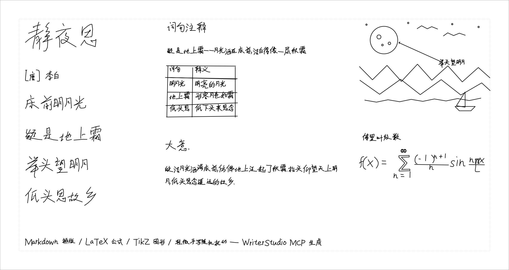

GRBL 写字机上位机软件。文字、表格、LaTeX公式、TikZ、SVG矢量图，笔画编辑，手写模拟 一个软件全搞定：
可多字体混排、可调手写随机扰动、可纸张对齐参考层。



## 下载与使用

到 [Releases](https://github.com/ZhengXieGang/WriterStudio/releases) 页面下载对应平台的文件：

| 平台 | 文件 | 用法 |
|------|------|------|
| Windows | `WriterStudio.exe` | 下载后双击运行，免安装 |
| Windows | `WriterStudioMCP.exe` | AI 智能排版（MCP）桥，无需运行；供 AI 应用的 MCP 配置引用，见[下文](#ai-智能排版mcp) |
| macOS | `WriterStudio-macos.zip` | 解压后将 WriterStudio.app 拖入「应用程序」 |
| Linux | `WriterStudio-x86_64.AppImage` | 下载后 `chmod +x` 直接运行 |

可选安装 TeX 工具链（ `xelatex` + `pdftocairo`）

## 功能特性

### 书写内容
* **多字体混排**：单文档内任意字符指定字体，自动回退链（如中文楷体 + 英文单线体）
* **手写随机扰动**：字号/位置/行首偏移/基线起伏/笔画级抖动，三级预设 + 全参数可调，
  确定性随机（同种子可复现，可整体重摇）
* **Markdown**：标题/列表/表格，表格行线手绘化随机，单元格文字跟随行线起伏
* **LaTeX**：公式用内置 mathtext 引擎渲染（免装 TeX）；完整 LaTeX 文档
  未装 TeX 时自动用内置排版引擎渲染常用子集（标题/章节/列表/公式/简单表格），
  检测到 TeX 工具链则自动升级为 PDF→SVG 忠实编译；TikZ 图形需要 TeX
* **矢量绘图与 SVG 导入**：矩形/椭圆/线条等图元，SVG 可带手绘抖动导入
* **文字方向**：横排、竖排都支持
* **逐字符字体覆盖**：选中文本中的字符单独指定字体/缩放

### 编辑与排版
* 笔画编辑工具：单笔画移动/变换/弯折/重扰动/删除
* 纸张预设与**参考层**：可导入图片/SVG 底图作为位置参考

## 支持的字体格式

| 类型 | 扩展名 | 说明 |
|------|--------|------|
| Hershey 单线 | `.jhf` | 内置 32 款拉丁/符号字体 |
| 单线笔画 JSON | `STRK-*.json` | 内置中文楷体（20976 字形） |
| TrueType/OpenType | `.ttf` `.otf` | 经 fontTools 解析轮廓转单线 |
| gcode 字符库 | 每字符一文件 | 每字符一段 G-code 的字库目录 |
| `.gfont` | `.gfont` | 单线笔画字体包 |

## AI 智能排版（MCP）

让 AI Agent（Claude Desktop、Cline 等支持 MCP 的应用）直接在软件里完成
整页排版：手写文字、数据表格、坐标系图、公式，排版结果可直接发送打印。
所有修改都在软件里可撤销。

**工作方式**：软件内嵌一个仅监听本机（127.0.0.1:8765）的服务，MCP 客户端
再通过一个「桥」进程接入。桥只是一个无界面的翻译器，必须配合**打开着的
WriterStudio** 使用；它随软件一同分发，各平台的获取方式：

| 平台 | 桥在哪 | MCP 配置写法 |
|------|--------|--------------|
| Windows | Release 页单独下载 `WriterStudioMCP.exe`，放到固定目录 | `"command": "C:\\Tools\\WriterStudioMCP.exe"` |
| Linux AppImage | 已内置，无需额外下载 | `"command": "/你的路径/WriterStudio-x86_64.AppImage"`，`args` 前加 `"--mcp"` |
| macOS | app 包内：`/Applications/WriterStudio.app/Contents/MacOS/WriterStudioMCP` | `"command"` 填该完整路径 |
| 源码运行 | `pip install '.[ai]'` 后得到 `writerstudio-mcp` 命令 | 或 `"python -m writerstudio.ai.bridge"` |

以 Windows 为例，加入 AI 应用的 MCP 配置（端口以软件「AI 排版 →
AI 服务设置…」对话框显示为准，默认 8765）：

```json
{
  "mcpServers": {
    "writerstudio": {
      "command": "C:\\Tools\\WriterStudioMCP.exe",
      "args": ["--port", "8765"]
    }
  }
}
```

Linux AppImage 的 `args` 则是 `["--mcp", "--port", "8765"]`。配置好后
Agent 可用 18 个工具：查页面/字体/对象，添加文本/Markdown/TikZ/公式，
移动/变换/删除，`check_layout` 布局自检，`render_preview` 渲染自查，
导出 G-code，打开/保存项目。

## 许可

本软件：GPL-3.0-or-later，详见 [LICENSE](LICENSE)。

内置字库的第三方数据：

* `fonts/builtin/hershey/*.jhf` —— Hershey Fonts。原始创建者 Dr. A. V. Hershey
  （U.S. National Bureau of Standards），字体数据格式来自 James Hurt（Cognition,
  Inc.）。可自由使用（含商业），须随数据保留致谢文本，见
  [`fonts/builtin/hershey/ACKNOWLEDGEMENT.txt`](writerstudio/fonts/builtin/hershey/ACKNOWLEDGEMENT.txt)。
* `fonts/builtin/stroke-json/STRK-Kaiti.json` —— 中文单线字库，由
  [chinese-hershey-font](https://github.com/LingDong-/chinese-hershey-font)（MIT，
  Copyright (c) 2018 Lingdong Huang）从 TTF 生成。

<details>
<summary><b>从源码运行</b></summary>

```bash
pip install -r requirements.txt   # 或 pip install .
python -m writerstudio            # 启动界面
python -m pytest -q               # 运行测试（无需显示器）
```

</details>

<details>
<summary><b>构建</b></summary>

PyInstaller 不能交叉编译，三个平台各自原生构建：

```bash
pip install pyinstaller
pyinstaller writerstudio.spec    # Windows 出单文件便携 exe；Linux/macOS 出目录版
python scripts/make_appimage.py  # Linux：把目录版组装成 AppImage（零安装分发）
```

</details>

<details>
<summary><b>目录结构</b></summary>

```
├── writerstudio/
│   ├── core/       数据层（纯 Python，无 Qt 依赖）
│   ├── fonts/      字体系统（5 种格式解析 + 排版引擎 + 扰动管道）
│   ├── perturb/    手写扰动引擎
│   ├── content/    Markdown / LaTeX / TikZ / SVG 导入
│   ├── machine/    G-code 生成 / GRBL 协议 / 串口链路 / 路径优化
│   ├── ai/         AI 智能排版（MCP 服务 + stdio 桥）
│   └── ui/         PySide6 界面层
├── tests/          单元测试（`python -m pytest -q`，离屏运行）
├── tools/          辅助脚本
└── scripts/        AppImage 组装、AI 排版演示脚本
```

测试全部离屏可跑（`QT_QPA_PLATFORM=offscreen`），无显示器环境/CI 直接执行。

</details>
